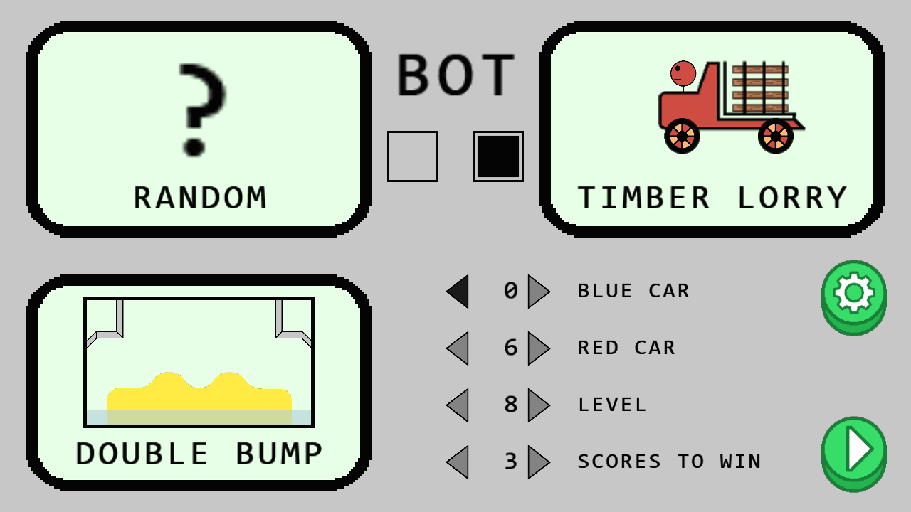
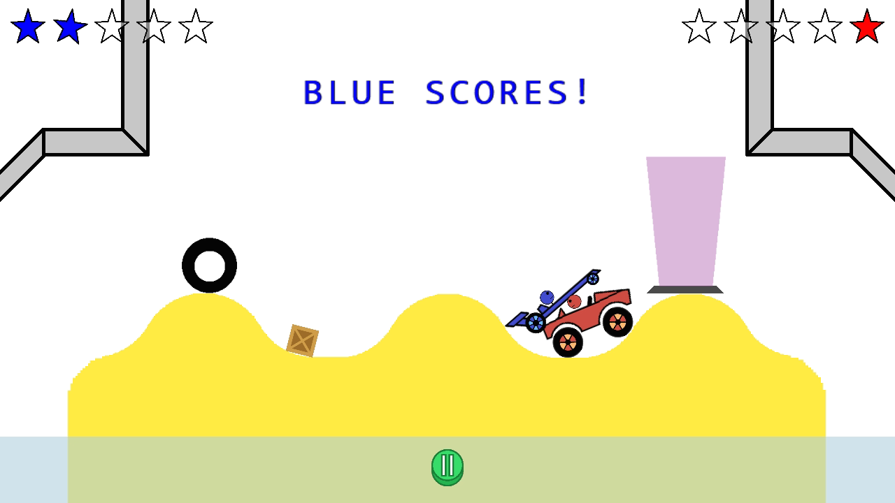
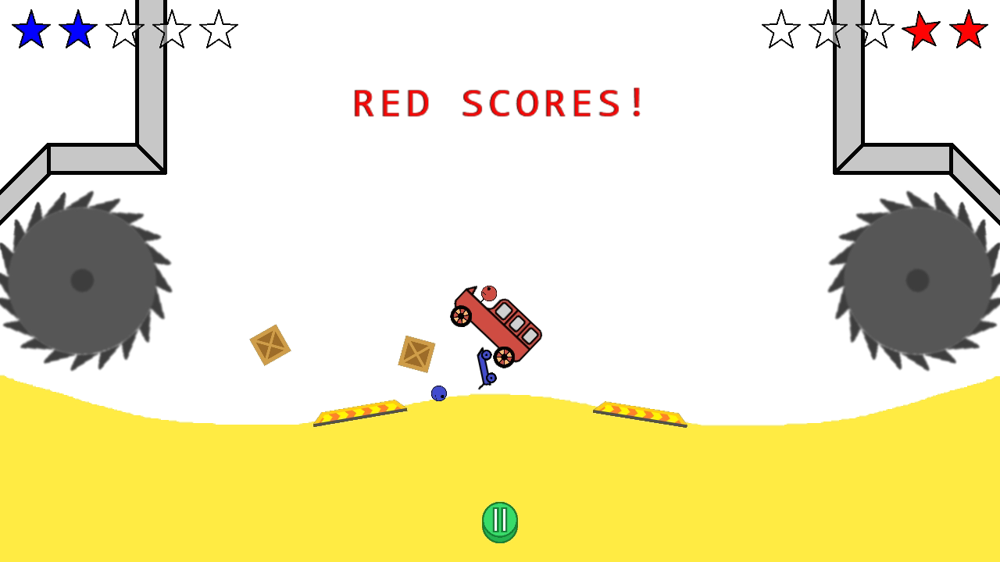

# Rivet Rival
A cross-platform [Drive Ahead](https://play.google.com/store/apps/details?id=com.dodreams.driveahead&hl=en) clone game built using [my game framework](https://github.com/thealing/GameFramework).
## Keybindings
- Enter - start, restart
- Space - pause, resume
- Backspace - leave
- A - blue backward
- D - blue forward
- Left Arrow - red forward
- Right Arrow - red backward
## Screenshots

